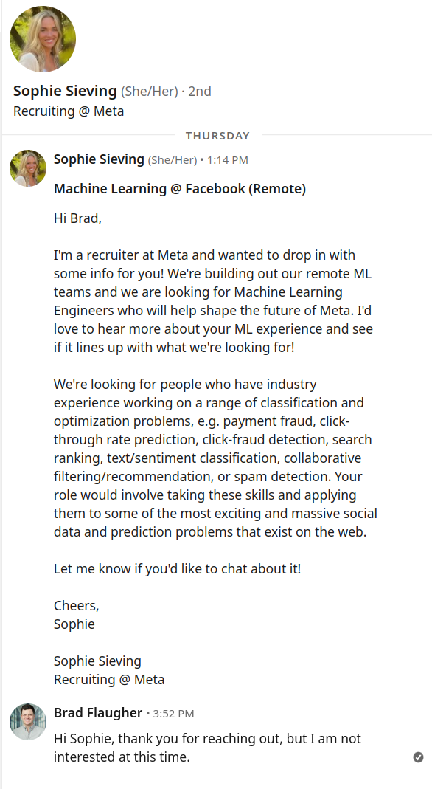

# ML

## Docker Notes

[just use the latest tensorflow if it's nothing fancy](https://www.tensorflow.org/install/)

```
sudo docker run --gpus all -u $(id -u):$(id -g) -v $(pwd):/tf -it --rm -p 8888:8888  tensorflow/tensorflow:latest-jupyter
```

### Build (from folder in install/ directory)
```
sudo docker build -t myproject install/ -f install/Dockerfile
```

### Run GPU w/ [nvidia-docker](https://github.com/NVIDIA/nvidia-docker)
```
sudo docker run --gpus all -u $(id -u):$(id -g) -v $(pwd):/tf -it --rm -p 8888:8888 projectname
```

### Run and share files in Windows
```
docker run -v ${PWD}:/tf -it --rm -p 8888:8888 projectname
```

## "Gold Standard" Projects from past bootcampers

* [Oleh's Project](https://github.com/MorhaliukOL/ML_Project)
* [Hanna's Project](/Profitable_Visitor_Classification_With_Notes.ipynb)


## What kinds of models to people want to see?

May 13, 2022



(from a former bootcamper after I shared this)
Omg, this is exactly what we did in the bootcamp! Do you think Image classification would be good enough to show if I did apply not now of course but maybe like later on when I feel like I am confident in it or should I also do something they are looking for like spam detection, that sounds cool.... when I’m done with that I could definitely familiarize myself more with image classification because I feel like I know some stuff but I want to study more since I have more time now and become confident in what I know.
