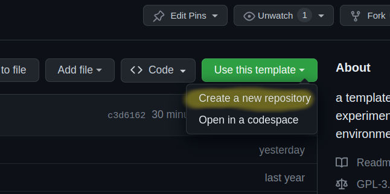
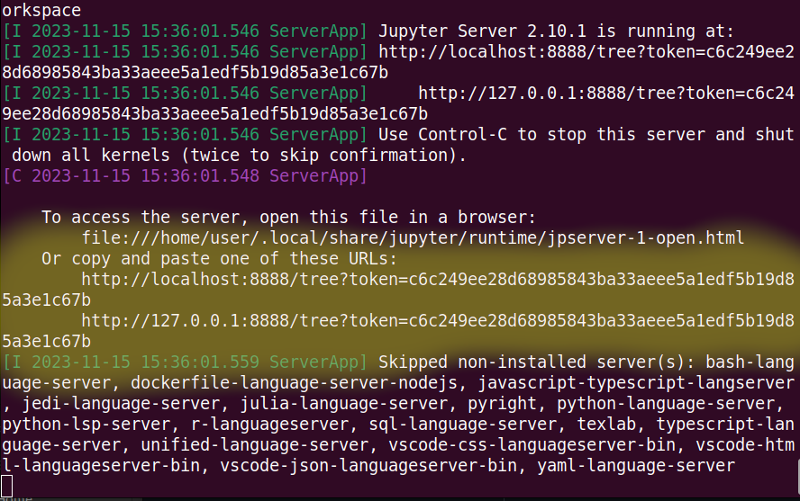

# Universal ML-Template

This comprehensive template is designed to facilitate the development of machine learning projects using a variety of tools and frameworks. Whether you're a beginner or an experienced ML practitioner, this template provides a structured and efficient approach to building and deploying ML models.

### Quick Start Guide

0. **Use this template to create your own repository**
    - then git clone your repository, follow this guide [create a repository from a template](https://docs.github.com/en/repositories/creating-and-managing-repositories/creating-a-repository-from-a-template)
    - you can watch this video for a quick guide on how to do it [youtube guide](https://www.youtube.com/watch?v=Mby9F-BP6I0)



1. **Setting Up Your Environment**
    - **Install Docker**:  Follow the instructions at [https://docs.docker.com/engine/install/](https://docs.docker.com/engine/install/) to set up Docker on your machine.
    - **OpenAI API Keys (Optional)**: If you plan to integrate OpenAI's APIs (via [open-interpreter](https://github.com/KillianLucas/open-interpreter) or [scikit-llm](https://github.com/iryna-kondr/scikit-llm)), set up your API keys as described in the [installation guide](./docs/INSTALL.md).

2. **Understanding the Philosophy**
    - **Template Philosophy**: Gain insights into the design and purpose of this template by reading [PHILOSOPHY.md](./docs/PHILOSOPHY.md).

3. **Running Examples**
    - **Access Pre-Built Examples**: Explore practical examples in the [examples](./examples/) folder to jump-start your project.
    - **Set Up the Docker Image**:
        - Run `bash start.sh`.
        - When asked if you want to run open-interpreter, say no. answer everything else normally.
        - Open the Jupyter Notebook link (e.g., `localhost...`) and navigate to the examples folder.



4. **Building Your Own Models**
    - **Using TensorFlow or PyTorch**: Tutorials for creating custom models using popular frameworks are available at [./notebooks/README.md](./notebooks/README.md).

5. **Leveraging [Open-Interpreter](https://github.com/KillianLucas/open-interpreter/) for Model Creation**
    - We do this within a docker container for the safety of your local machine, but also to allow for a 'clean' environment to install and experiment with new dependencies.
    - **Automate Model Creation with GPT-4**:
        - Initialize the Docker image with `bash start.sh` and when asked say `y` that you want to run open interpreter.
        - Input commands to the interpreter, e.g., _"create a dummy dataset of 10 statements often associated with republicans, democrats, libertarians and socialists then write me a deep neural network in pytorch using torchtext to classify those statements, write the training loop and also test the model on a new statement."_
        - Exit the interpreter by pressing `CTRL-C`.
        - Chat history is stored in the [./chats](./chats) folder

### Additional Features
- **Comprehensive Documentation**: Each step of the process is well-documented to ensure a smooth user experience.
- **Modular Design**: The template's modular structure allows for easy customization and expansion to fit specific project needs.
- **Community Support**: Engage with the community for troubleshooting, tips, and sharing best practices. Join us at [https://discord.gg/medusaml](https://discord.gg/medusaml)

## Production Deployment Warning and Best Practices

### ⚠️ Warning: Not Intended for Production Use ⚠️
This repository is primarily designed for fitting models and exporting them, rather than for running them in a production environment. Please note the following important points:

- **Non-Versioned Dependencies**: The dependencies used in this repository are not versioned. Many dependencies rely on nightly or "latest" builds.
- **Stability Not Guaranteed**: Stability and long-term support are not the primary goals of this repository. It's optimized for experimentation and model fitting rather than production stability.

### 🚀 Best Practices for Deploying Models to Production
When deploying models to a production environment, consider these best practices to ensure efficiency, stability, and security:

1. **Create a Slim Dockerfile**: Design a Dockerfile specifically for production. Ensure it only includes the necessary components, keeping it as lightweight as possible.

2. **Freeze Dependency Versions**: Always specify the exact versions of your dependencies. This practice reduces the risk of unexpected behavior caused by updates in dependencies.

3. **Avoid Unnecessary Dependencies**: Only install the dependencies that are absolutely necessary for your application to run. This minimizes the potential attack surface for security vulnerabilities and reduces the overall size of your deployment.

4. **Regularly Update and Maintain**: Keep your dependencies and your application updated with the latest security patches. Regular maintenance is crucial for the longevity and security of your production environment.

5. **Performance Optimization**: Tailor your environment for optimal performance. This includes selecting the right hardware specifications and tuning your model and application settings for the best performance.

6. **Security Best Practices**: Follow standard security best practices, including using secure communication protocols, implementing proper authentication and authorization mechanisms, and regular security audits.

7. **Monitoring and Logging**: Implement comprehensive monitoring and logging to quickly identify and respond to issues in the production environment.

8. **Scalability Considerations**: Design your deployment with scalability in mind. This ensures that your application can handle increased load without degradation in performance.

By adhering to these best practices, you can create a more robust, secure, and efficient production environment for your machine learning models.

# FAQ

## How to I shut down the notebook?

* Go to the terminal where you ran the ```start.sh``` script and press ```CTRL+C```, [Why does it work that way?](https://askubuntu.com/questions/520454/why-do-we-use-ctrl-c-ctrl-x-ctrl-z-in-terminal)

## What the hell is this notebook stuff?

* Try this tutorial to learn more [tutorial](https://jupyter.org/try)

